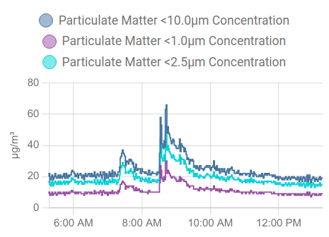

# Esphome particule sensor

The LGO303 "Personal Air Quality Detector PM1 PM2.5 PM10 with display" is a great value for money air quality sensor. It seems to work a pmsx003 air sensor which display informations in a nice display (Nextion grade) 

The idea of this project is to add wifi support to it, for that I required :
- an esp01s
- an FTDI USB adapter
- 3 wires

## Preparation : first time flash with FTDI

```
git clone git@github.com:PascalNoisette/esphome-particule-sensor.git
cd esphome-particule-sensor
# remember to change passwords in the secrets file.
sudo docker run --rm -v "${PWD}":/config --device=/dev/ttyUSB0 -it esphome/esphome run particule.yaml
```

## Wiring

esp01s is powered with an unused ground pad and a 3.3v pad of the PCB inside LGO303
esp01s GPIO02 is hooked to PM_RX


## flash with OTA

```
sudo docker run --rm --net=host -v "${PWD}":/config  -it esphome/esphome run particule.yaml
```

## History graph in Home Assistant

```
  - type: history-graph
    entities:
    - sensor.particulate_matter_10_0um_concentration
    - sensor.particulate_matter_1_0um_concentration
    - sensor.particulate_matter_2_5um_concentration
    
```


